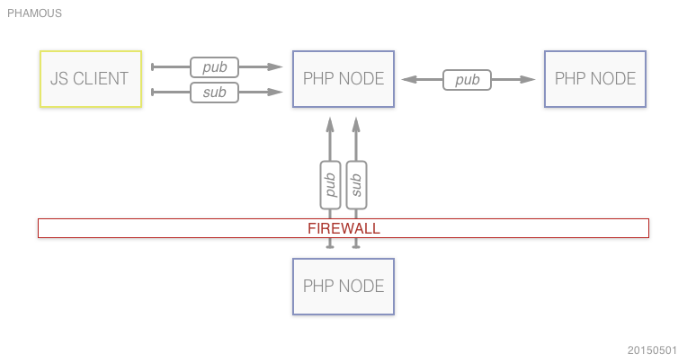

# BackbonePHP (BackboneJS + PHP)

BackbonePHP is a micro-framework for single-page applications with:

* data views that can be indexed by search engines,
* automatic UI updates when underlying data changes,
* publish/subscribe-like data exchange between client and server nodes
* simple server setups as target environment (e.g. shared hosts)

### Core Libraries and Technologies used

* [BackboneJS](https://github.com/jashkenas/backbone): client-side router, models, collections
* [PHP](http://php.net/): RESTful JSON API, data synchronization, XML Sitemap files, server-side views, custom handlers
* [SQLite](http://www.sqlite.org/): server-side data, sessions, cache
* [UnderscoreJS](https://github.com/jashkenas/underscore/): templating, array operations
* [VelocityJS](https://github.com/julianshapiro/velocity/): UI transitions and animations

## Features

* Front Controller serving generic BackboneJS view with minimal server-generated content (only SEO-relevant parts like title and plain model content)
* JSON-based configuration for both server-side and client-side components
* As much app logic as possible in JavaScript or JSON, server-side PHP only for validation and custom processing beyond built-in JSON API
* admin panel for accounts (email of 1st admin is specified in config), model data, background script status, event logs, (confirmation of model changes?)
* self-monitoring and auto-restarting scripts for background operations
* message-based synchronization
* dynamic XML Sitemap and HTML generation for selected model data

## Configuration

* server nodes including synchronization settings 
* permissions and groups (see below)
* routes
* models
* a non-public, server-only config file for admin user, imap, api keys, etc.

## User Management

* User accounts (stored in DB, not config)

        {
            id: "mail@example.com",
            passwordHash: "7dsf3648723644...",
            passwordAlgorithm: "php_hash",
            groups: ["admin"]
        }

* Permissions consist of read/write access patterns and optional restrictions (stored in config)

        "edit-everything": {
            "allow": { 
                "read": "/",
                "write": "/"
            }
        },
        "read-all-posts": {
            "allow": { 
                "read": "/posts"
            }
        },
        "read-public-posts": {
            "allow": {
                "read": "/posts/:id",
                "if": ["/posts/:id/state === 'public'"]
            }
        },
        "manage-own-posts": {
            "allow": {
                "read": "/posts/:id",
                "write": "/posts/:id",
                "if": ["/posts/:id/author === $user"]
            }
        }

* Groups are sets of permissions (stored in config, with built-in groups "*" and "admins"):

        {
            id: "*",
            permissions: ["read-public-posts", "create-session"]
        },
        {
            id: "admin",
            permissions: ["edit-everything"]
        },
        {
            id: "user",
            permissions: ["edit-own-posts"]
        }

## Models with routes

        {
            "assets": "/src/posts",
            "phpClass": "MyNamespace\Post",
            "typeUri": "http://schema.org/Post",
            "routes": {
                "/posts": "collection",
                "/posts/:id": "resource",
                "/blog(/:year)(/:month)(/:day)": "collection-url",
                "/blog/:slug": "resource-url"
            ],
            "fields": {
                "slug": {
                    "type": "string",
                    "format": "[0-9]{4}-[0-9]{2}-[0-9]{2}-.{1,128}",
                    "robots": false
                },
                "title": {
                    "type": "string",
                    "format": "[\s\S]{1,128}",
                    "typeUri": "http://schema.org/title"
                },
                "body": {
                    "type": string,
                    "format": "[\s\S]{1,}"
                },
                "year": {
                    "type": "integer",
                    "format": "[0-9]{4}"
                },
                "month": {
                    "type": "string",
                    "format": "[0-9]{2}"
                },
                "day": {
                    "type": "string",
                    "format": "[0-9]{2}"
                },
                "state": {
                    "type": "enum",
                    "options": ["draft", "public", "private", "secret"]
                    "robots": false
                },
                "author": {
                    "type": "resource",
                    "format": "/users/:id"
                }
            }
        }

## Request Dispatching

* **`GET /sitemap.xml`**: 
    * output: XML Sitemap index file based on model collection routes

* **`GET /posts/sitemap.xml`**: 
    * output: XML Sitemap file with pointers to all posts

* **`GET /blog/2015-01-01-hello-world`**: 
    * detected route: `/blog/:slug`
    * detected parameter "slug": `2015-01-01-hello-world`
    * detected source directory: `/src/posts`
    * PHP class file: `/src/posts/Post.php` or `/vendor/bnowack/backbone-php/src/Resource.php`
    * Backbone model: `/src/posts/Post.js` or `/vendor/bnowack/backbone-php/src/Resource.js`
    * Backbone view: `/src/posts/PostView.js` or `/vendor/bnowack/backbone-php/src/ResourceView.js`
    * output (accept html): index.htm with raw microdata-enhanced HTML5 for the selected post
    * output (accept json): post data
            
* **`GET /blog/2015/01`**: 
    * detected route: `/blog(/:year)(/:month)(/:day)`
    * detected parameter "year": `2015`
    * detected parameter "month": `01`
    * detected source directory: `/src/posts`
    * PHP class file: `/src/posts/PostCollection.php` or `/vendor/bnowack/backbone-php/src/ResourceCollection.php`
    * Backbone collection: `/src/posts/PostCollection.js` or `/vendor/bnowack/backbone-php/src/ResourceCollection.js`
    * Backbone model: `/src/posts/Post.js` or `/vendor/bnowack/backbone-php/src/Resource.js`
    * Backbone view: `/src/posts/PostCollectionView.js` or `/vendor/bnowack/backbone-php/src/ResourceCollectionView.js`
    * output (accept html): index.htm with raw microdata-enhanced HTML5 for all posts with `year=2015` and `month=01`
    * output (accept json): list of posts with `year=2015` and `month=01`

## JSON API

* following the [JSON API proposal](http://jsonapi.org/)
* automatic support for all defined models
* custom extensions at PHP and/or JS level
* default collection parameters: `limit`, `offset`, `fields`
* default collection sub-resources: `count`, `search`
            
## Background Scripts

* 2-n scripts keep running in the background for UI-less operations
* server nodes and scripts ping each other to control that each node's background scripts stay alive or get re-invoked automatically
* example use cases: fetch data from 3rd-party sites, process/convert/import/export data

## Client Synchronization

* depending on the number of active connections on a server node, each client gets:
    * an SSE stream or long-polling pointer (low traffic)
    * instructions for delayed polling (high traffic), e.g. every 30 seconds
* clients can register a session with the server node 
* client-side models can subscribe to data events and auto-refresh their views
    * e.g. `/posts`
* client-side nodes get "informed" when their subscriptions change (SSE/long-polling/polling)
    * server nodes generate cached files for client subscriptions,
      so that application performance is not affected even by frequent polling
    * sessions and cache watchers expire when clients drop the connection

## Event Log

* System events get logged locally for processing and syndication through background scripts
* The Event Log gets partitioned automatically to keep read/write operations efficient
* The format is based on JSON Patch (RDF 6902), with added (micro-)timestamp, origin node, and user fields

        {
            "op": "add",
            "path": "/posts/2015-01-01-hello-world",
            "value": "{\"title\": \"Hello World\", ... }",
            "timestamp": 123456789.1234,
            "origin": "https://node1.example.com/myapp",
            "user": "admin"
        },
        {
            "op": "remove",
            "path": "/posts/2015-01-01-test-post",
            "timestamp": 234567890.1234
            "origin": "https://mirror.example.com/myapp"
            "user": "john@doe.com"
        }

## Server Node Synchronization

* Nodes pub/sub to/from data events on other nodes (via background scripts) as specified in the (server) configuration
* A shared secret is transferred during the very first sync operation
* Nodes fat-ping all non-firewalled nodes with their own events
* Firewalled nodes can't be accessed, they have to push their events **and** pull their subscriptions from all other nodes
    * Example scenario: a Raspberry Pi behind a DS-Lite gateway that is used for home automation. 
      The Pi needs to pub/sub to keep all nodes sync'd, like turning on a light in the local network even when the
      corresponding command (such as `PUT /devices/kitchen-light {"status": "on"}`) is executed on a remote node.
        
            "nodes": {
                "https://example.com/my-home": {
                    "subscriptions": [
                        "/devices"
                    ]
                },
                "http://192.168.0.27/my-home": {
                    "firewalled": true,
                    "subscriptions": [
                        "/devices"
                    ]
                },
                "http://192.168.0.27/backup": {
                    "firewalled": true,
                    "subscriptions": [
                        "*"
                    ]
                }
            }

## Example Program Flow

* client C1 retrieves a list of posts (`GET /posts`) from server node S1
    * S1 creates a subscription cache for C1 (identified by session cookie or user cookie)
* client C2 retrieves a list of posts (`GET /posts`) from server node S1
    * S1 creates a subscription cache for C2
* client C3 retrieves a list of posts (`GET /posts`) from server node S2
    * S2 creates a subscription cache for C3
* client C1 creates a new post (`POST /posts {"title": "hello world"}`) on server node S1
    * S1 updates the subscription cache of C1
        * The C1 BackboneJS PostCollection receives the updated list of posts and can refresh its view(s)
    * S1 updates the subscription cache of C2
        * The C2 BackboneJS PostCollection receives the updated list of posts and can refresh its view(s)
    * S1 fat-pings S2 about the new post
        * S2 updates the subscription cache of C3
        * The C3 BackboneJS PostCollection receives the updated list of posts and can refresh its view(s)
* client C1 no longer refreshes its connection with S1
    * S1 removes the subscription cache for C1
